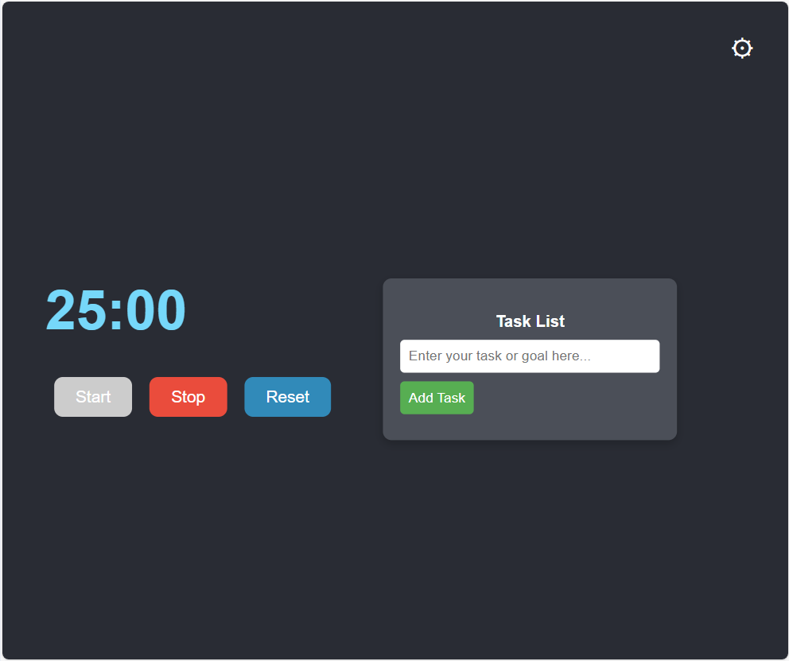
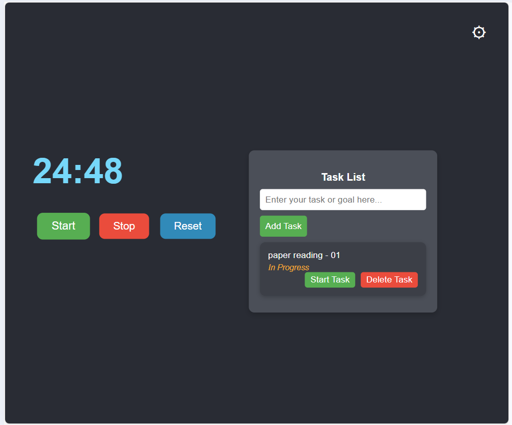
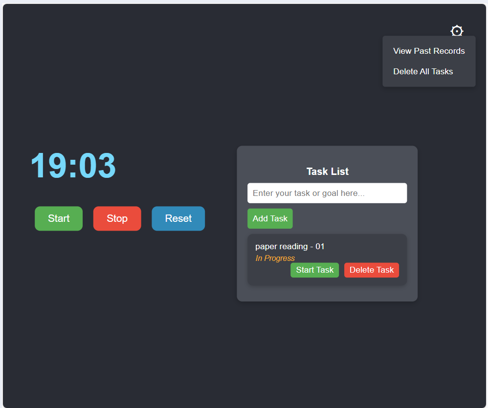
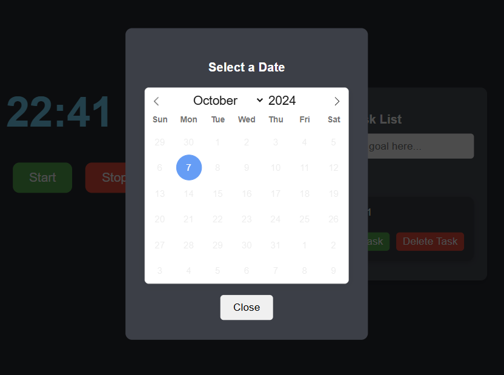
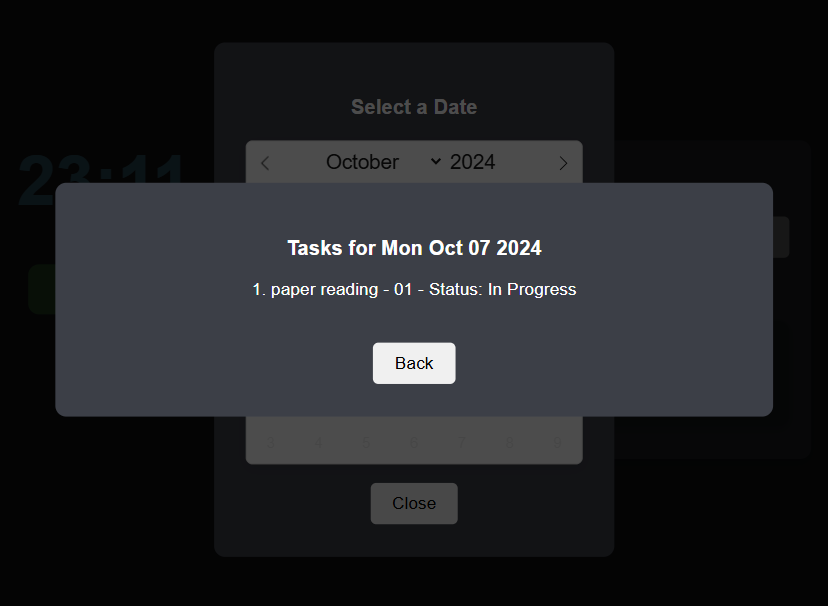

# Pomodoro Task Manager

A simple Pomodoro timer and task management application built with Vue.js, TypeScript, and Vite.

## Table of Contents

- [Introduction](#introduction)
- [Features](#features)
- [Screenshots](#screenshots)
- [Installation](#installation)
- [Dependencies](#dependencies)
- [Usage](#usage)
- [Contributing](#contributing)
- [License](#license)

## Introduction

Pomodoro Task Manager is a productivity application that helps you manage your tasks using the Pomodoro Technique. It allows you to create tasks, start a Pomodoro timer for focused work sessions, and keep track of your completed and pending tasks.

## Features

- **Task Management**: Add, delete, and manage your tasks.
- **Pomodoro Timer**: Start a timer for focused work sessions.
- **Task Status Tracking**: View the status of each task (Not Completed, In Progress, Completed).
- **Past Records**: View tasks completed on previous dates.
- **Data Persistence**: Tasks and their statuses are saved in local storage.

## Screenshots

<!-- Add screenshots of your application here -->
- Home interface

- working interface

- settings interface

- task records interface

- specific task records interface


## Installation

1. **Clone the repository**

   ```bash
   git clone https://github.com/ChristopheZhao/pomodoro-timer

2. **Navigate to the project directory**

   ```bash
   cd pomodoro-timer
   ```

3. **Install dependencies**

   ```bash
   npm install
   ```

4. **Install TypeScript type definitions**

   ```bash
   npm install --save-dev @types/flatpickr
   ```
